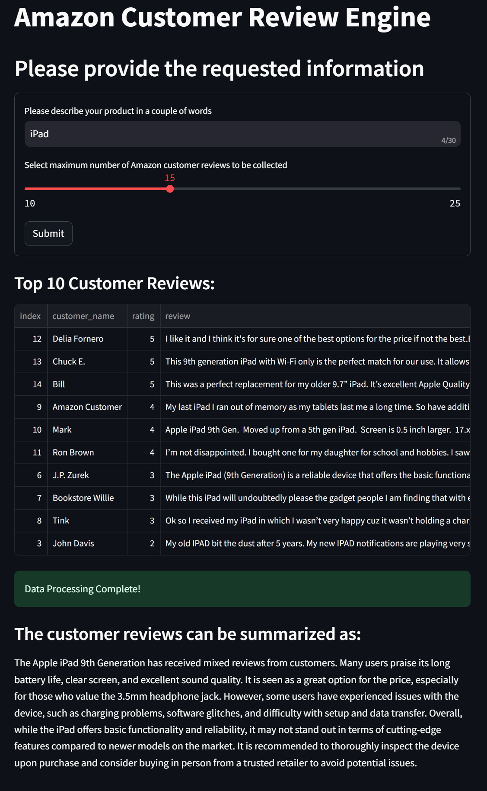

# Customer Review Engine

This project automates the process of harvesting and summarizing Amazon customer reviews for a specified product. Using OpenAI, it provides a concise summary of customer feedback, helping users quickly understand the general sentiment and key points from multiple reviews.

## Demo



## Getting Started

### Installation

1. Clone the repository:
   ```bash
   git clone https://github.com/shahmitul-genai/ReviewEngine
   ```

2. Navigate to the project directory
   ```bash
   cd customer_reviews
   ```

3. Install Poetry using pip (if not already installed):
   ```bash
   pip install poetry
   ```

4. Activate the virtual environment created by Poetry:
   ```bash
   poetry shell
   ```

5. Install project dependencies using Poetry:
   ```bash
   poetry install
   ```

### Configuration

Create a `.env` file and add your own OpenAI API key in the `.env` file as follows:

```bash
OPENAI_API_KEY='your-key-here'
```

### Usage

1. After installing the dependencies, you can run the Streamlit app in root directory by executing the following command:
   
   ```bash
   streamlit run app_cr.py
   ```

2. Follow the prompts to input the product description 

3. Move the slide bar to select number of reviews to pull.

4. The script will display the top 10 ranking customer reviews and the overall review summary.

## License

This project is licensed under the MIT License. See the [LICENSE](LICENSE) file for details.